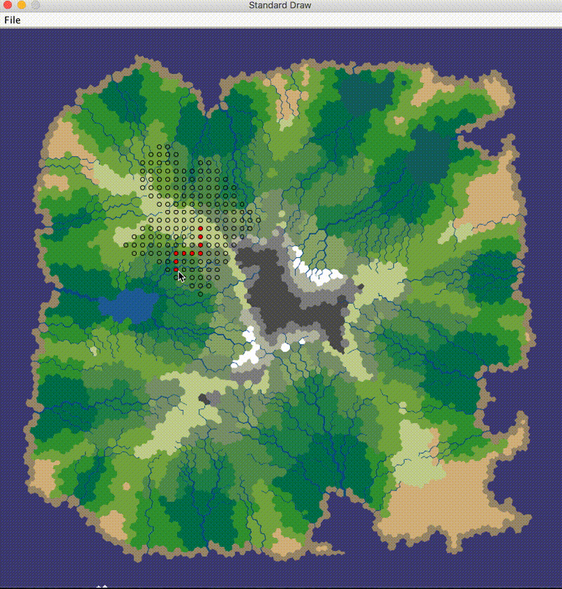

# Game Map
This project is to find the shortest path on the given map. The map is produced by the project [Java-Delaunay](https://github.com/Hoten/Java-Delaunay.git) from GitHub. You can get other maps for testing: just replace the map in the folder resources.

## Installation
Download the zip file. Then open it in Netbeans.

## Usage
### 1. With two arguments
At first, I studied the situation that the project run with only two arguments (path of the map image, grid size). To configure them, in the menu bar, Run > Set Project Configuration > Customize …, in Arguments, you can modifies the arguments. Normally, I already set three arguments. You can delete the third one and change the second one.

**Remark** the arguments should be in quotas and separated by a space.

Rue the project (just click the green button), then click on the map to define the start point, when you move the mouse without clicking, you can get always the shortest path (red dots). If you move the mouse on a unavailable point (e.g. ocean), you won’t get the red path but full searched points (black). 

### 2. With three arguments
Then I studied the the project running with three arguments (path of the map image, grid size, path of txt file). The txt file includes some pairs of numbers that represents the xy of all points that the path should go through. The idea of this part is that the project find the shortest path by reordering these pants. There is an example txt file in the src/main/resources folder. The third argument is “src/main/resources/test.txt”.

**Remark** I haven’t realized this algorithm, for now, it can only find the shortest path by going through these points in default order.

With grid size 15 and an example of three points, you can get the result like the following figure,

